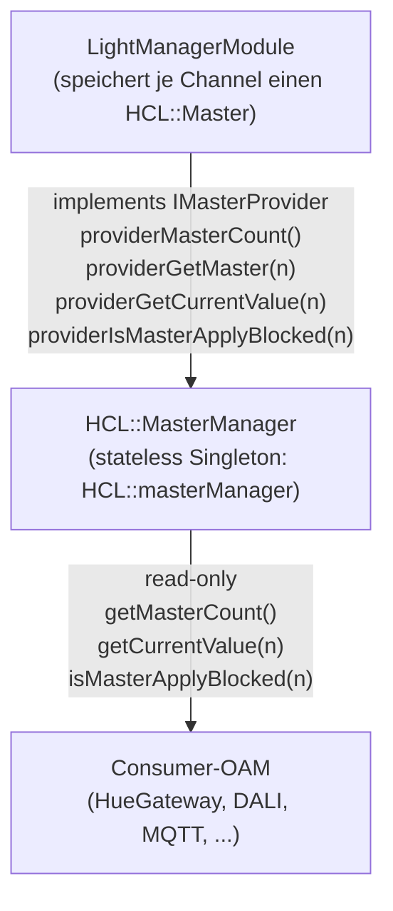

# OFM-LightManager — Integrationsleitfaden für Consumer-OAMs

Dieses Dokument beschreibt, wie ein OAM/OFM (z.B. **OFM-HueGatewayModule**,
DALI-Gateway, MQTT-Bridge, künftige Custom-Module) auf die vom
LightManager bereitgestellten **HCL-Master** zugreift und/oder ETS-seitig
die zentrale Master-Auswahl wiederverwendet.

> **Begriff:** Ein *HCL-Master* ist eine Sollwertquelle für *Brightness*
> und *ColorTemperature*, deren Verlauf entweder aus einer Tageszeitkurve
> oder aus Umgebungslux + Tag/Nacht interpoliert wird.

---

## 1. Architektur in Kürze



- Per-Channel-State (Master-Konfiguration, gecachter Interpolationswert,
  Apply-Lock) liegt im jeweiligen **`LightManagerChannel`**.
- `HCL::MasterManager` ist eine **stateless Fassade** mit globalem
  Zustand (Enable, Apply-Block, Update-Intervall, Fade-Dauer, Tagesuhr)
  und delegiert alle Master-Zugriffe an den registrierten Provider.
- Consumer dürfen die Fassade jederzeit lesen — auch ohne aktiven
  LightManager (sichere Defaults).

---

## 2. C++-API für Consumer

Header einbinden:

```cpp
#include <HCL/LightManagerApi.h>
```

### 2.1 Verfügbare Master ermitteln

Ab 0.4.0 werden Lichtmanager einzeln in der ETS-Kanalauswahl aktiviert. Die
Master-Nummern sind daher nicht mehr lückenlos: Nur aktivierte und nicht
suspendierte Master existieren zur Laufzeit.

```cpp
const uint8_t maxMaster = HCL::masterManager.getMasterCount(); // höchste Nummer (16), nicht die Anzahl
const bool exists = HCL::masterManager.getMaster(n) != nullptr; // bzw. openknxLightManagerModule.channel(n)
```

### 2.2 Wert eines Masters lesen

```cpp
uint8_t selected = paramFromEts;          // 1..16, 0 = "kein Master"
HCL::Master* m = HCL::masterManager.getMaster(selected); // nullptr, wenn nicht aktiviert
if (m)
{
    const auto v = HCL::masterManager.getCurrentValue(selected);
    // v.brightness : 0..100 (%)
    // v.kelvin     : z.B. 2000..6500 K
}
```

### 2.3 Output-Sperren respektieren

Vor jedem Hardware-Apply zwei Bedingungen prüfen:

```cpp
if (!HCL::masterManager.isApplyBlocked() &&                       // global
    !HCL::masterManager.isMasterApplyBlocked(selected))           // pro Master
{
    applyToHardware(v.brightness, v.kelvin);
}
```

### 2.4 Sensor-Daten zurückspeisen (optional)

Wenn das Consumer-OAM eigene Lux-Sensoren hat:

```cpp
HCL::reportAmbientLux(selected, luxValue);   // löst sofortiges Recalc aus
HCL::reportDaytime(selected, isDayFromAstro);
```

### 2.5 Zuordnung beim Anwenden prüfen

Da die ETS-Konfiguration einen festen Range (0..16) anbietet, der
zugeordnete Lichtmanager aber deaktiviert oder suspendiert sein kann, muss
das Consumer-OAM die Auswahl prüfen:

```cpp
uint8_t sel = ParamXYZHCLMaster;
if (sel != 0 && openknxLightManagerModule.channel(sel) == nullptr)
{
    logErrorP("HCL master %u not active in the LightManager - reset to 0", sel);
    sel = 0;
}
```

---

## 3. ETS-Integration (ParameterType-Sharing)

Damit alle Consumer-OAMs **dieselbe** Master-Auswahl-Dropdown anbieten
(und sich nicht versehentlich auseinanderentwickeln), exportiert der
LightManager den ParameterType **`PT-LMGMasterSelect`** in seiner
`LightManagerModule.share.xml`.

### 3.1 Voraussetzungen

- Das Consumer-OAM **muss** OFM-LightManager als Modul ins selbe
  Application-Bundle einbinden (gemeinsamer knxprod).
- Damit liegt `%AID%_PT-LMGMasterSelect` im gemeinsamen ParameterType-Pool.

### 3.2 Verwendung in `<MyModule>.templ.xml`

```xml
<Parameter Id="%AID%_P-%TT%5%CC%007"
           Name="CH%C%HCLMaster"
           ParameterType="%AID%_PT-LMGMasterSelect"
           Text="Zuordnung Lichtmanager"
           Value="0">
    <Memory CodeSegment="%MID%" Offset="4" BitOffset="0" />
</Parameter>
```

### 3.3 Was **nicht** mehr nötig ist

- Keine lokale `PT-XYZHCLMasterSelect`-Definition mit redundanter
  Enumeration mehr (vorher z.B. `PT-HUEHCLMasterSelect`).
- Keine Anpassung der Werte 0..16 wenn `LMG_MAX_MASTERS` einmal steigen
  sollte — der LightManager liefert die zentrale Pflege.

---

## 4. Empfehlungen / Best Practices

1. **Niemals** in den HCL-State schreiben (`Master::set...()`), außer
   eigene Sensor-Werte über `HCL::reportAmbientLux/Daytime`.
2. Den ETS-Parameter immer auf einen aktivierten Master prüfen (siehe 2.5).
3. Bei Aktualisierungsereignissen einfach in `loop()` lesen — der
   LightManager updated cached Werte deterministisch (`update interval`).
4. ApplyBlocked **immer** beachten — sonst überschreibt das Consumer-OAM
   manuelle Eingriffe (Präsenzfunktion / Szenenpriorität).
5. Wenn das Consumer-OAM eigene Channels mit eigener
   "Lichtmanager-Sperre" hat, diese **lokal** halten und nicht in den
   LightManager spiegeln.

---

## 5. Beispielimplementierung

Siehe `OFM-HueGatewayModule/src/HueGatewayModule.cpp`, Funktion
`HueGatewayModule::processChannelDeviceSetup()` — dort wird der
dynamische Clamp angewandt, und `HueLight::setHCLMaster()` speichert die
1-basierte Master-Nummer für die spätere Lookup-Verwendung.
